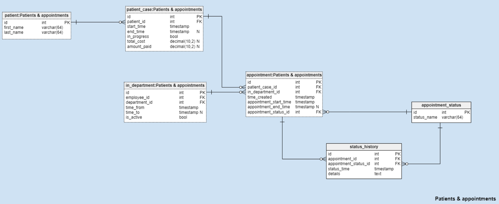

# Clinic-Management-System

## Clinic and department subject

clinic table contains the clinic info of all clinics exist on system. Each clinic has a number of department for a corresponding concern. Department table associate the corresponding department for it's clinic using clinic_id foreign key.

## Employee and Schedule

Employee table contains all empolyee working for all clinics. Each employee has a role specified in has_role table. has_role table associate the basic role description stated on role table with Employee. Each employee works for a department stated in in_department table. Schedule table state current and future schedule shifts of the Employee.

## Patient and appointment
 

## Documents
 
